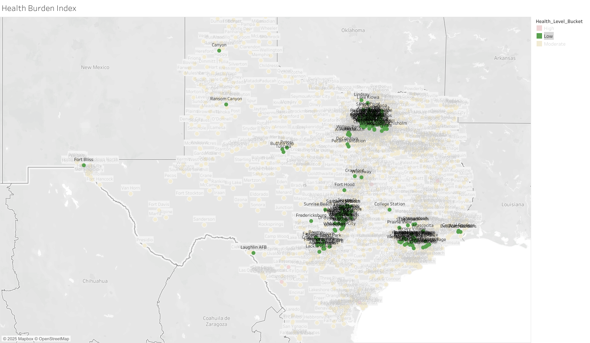

# Health Burden Index for Texas Cities (2024 CDC PLACES Data)
## Overview
This project analyzes city-level health burdens across Texas using the [**CDC PLACES Local 2024 dataset**](data) , which is based on the 2022 Behavioral Risk Factor Surveillance System (BRFSS) data. A custom **Health Burden Index (HBI)** was developed to assess the combined impact of four key health indicators: **obesity**, **diabetes**, **smoking**, and **depression**.

The goal is to identify cities with the highest health burden and explore patterns that can inform public health priorities and interventions.

## Objectives
* Calculate a Health Burden Index for each city in Texas
* Compare cities across Texas using **Health Burden Index (HBI)**
* Provide insights and recommendations for public health planning
* Highlight high-burden areas with clear, map-based visualizations

## Dataset Structure
The final dataset was derived from two tables within the same dataset file from the **CDC PLACES Local 2024 dataset**. One table contained health indicators (e.g. **obesity**, **diabetes**, **smoking**, and **depression**) and their values, while the other provided population counts. Both tables were linked using a common identifier, **LocationId**, to create a unified dataset for analysis. 

## Technical Process
The project followed these key steps:
1. **Data Extraction**  
   * Retrieved 2024 CDC PLACES Local data via BigQuery.
   * Selected relevant columns such as **MeasureId**, **Data_Value**, **LocationName**, **LocationId**, and **Geolocation**.
   * Focused on four prevalent health indicators: **obesity**, **diabetes**, **smoking**, and **depression**, all based on the 2022 BRFSS data.  
2. **Data Cleaning & Preparation**  
   * Removed rows with missing values for selected indicators.
   * Used CTEs to pivot and reshape the data.
   * Calculated a **Health Burden Index (HBI)** based on the average from the crude prevalence values of obesity, diabetes, smoking, and depression.
   * Joined in total population estimates via VLOOKUP from a secondary table.
3. **Google Sheets Processing**  
   * Applied conditional formatting to flag high, moderate, and low burden cities.
   * Computed national averages via BigQuery and colored cities above/below benchmarks.
   * Filtered for only Texas cities with a population above 500.
4. **Visualization in Tableau**  
   * Created a choropleth-style map to visualize **HBI** across cities.
   * Emphasized cities labeled "High" based on threshold logic (>=30).
   * Labels and tooltip customization applied for clarity.
   
For a more detailed process, click [here](work/data_cleaning_notes.md).

## Major Insights
* Nine cities in Texas were classified as having a **High HBI** (>= 30), signaling significant challenges in **obesity**, **diabetes**, **smoking**, and **depression**.
* All high-burden cities had rates **above the national average** for **obesity**, **diabetes**, and **smoking**, while **six out of the nine** exceeded the national average for **depression**:
   * **Obesity**: National Avg = 36.37%, City Range = 48.5%–53.3%
   * **Diabetes**: National Avg = 13.03%, City Range = 20.5%–28.1%
   * **Smoking**: National Avg = 16.61%, City Range = 20.7%–26.1%
   * **Depression**: National Avg = 23.19%, Three cities—South Point (23.10%), Gregory (23.10%), and Carrizo Springs (22.90%)—fell just **below** the threshold
* All nine cities had populations **under 6,500**, with **seven** located in **South Texas**, highlighting **regional and rural disparities** in chronic health burden.
* In contrast, Texas cities with the **lowest HBI** were concentrated in major urban areas such as **Austin, Dallas-Fort Worth, San Antonio**, and **Houston**, suggesting goegraphic and socioeconomic disparities. 

## Visualizations
Explore the distribution of the **Health Burden Index (HBI)** across Texas cities.
* **[Interactive Texas Health Burden Index Map](https://public.tableau.com/views/hbiplacestxover500/Sheet1?:language=en-US&:sid=&:redirect=auth&:display_count=n&:origin=viz_share_link)**: Tableau dashboard categorizing cities as **High**, **Moderate**, or **Low** based on the **Health Burden Index (HBI)**.
* **Static Snapshots**: Images below showcase cities with **High HBI** scores and **Low HBI** scores for quick visual comparison.  

## Recommendations
* **Target Local Interventions**: Focus public health resources on rural South Texas communities where chronic condition rates consistently exceed national averages.
* **Mobile Health Services**: Deploy mobile clinics or community health vans to improve access to screening, primary care, and mental health services in smaller towns with limited infrastructure.
* **School and Community-Based Programs**: Launch early-intervention programs targeting nutrition, physical activity, and mental health support in schools and community centers.

## Action Plan
* **Apply Interventions**: Implement targeted programs in high-burden communities based on the recommendations outlined above.
* **Monitor Progress**: Reassess the **Health Burden Index** annually using updated data to track changes in obesity, diabetes, smoking, and depression.
* **Evaluate & Adjust**: Use year-over-year trends to evaluate impact and refine strategies for more effective long-term public health planning.

## Repository Contents
* README.md – Project overview, objectives, technical process, insights, and recommendations.
* data/ – Information about the dataset and external link to the full CDC PLACES dataset.
  * dataset_link.md – Link to the original CDC PLACES dataset (2024 release).
* work/ – Project work files, including SQL queries and spreadsheet.
  * sql_queries.sql – All SQL queries used for data filtering, cleaning, and analysis.
  * HBI_places.xlsx – Cleaned and processed spreadsheet with final calculations.
  * data_cleaning_notes.md – Step-by-step explanation of data cleaning and transformation steps.
* images/ – Visual outputs and dataset schema references.
  * places.png - Table schema and dataset structure diagram.
  * txhigh.png - Tableau map visualization of high-burden Texas cities.
  * txlow.png - Tableau map visualization of low-burden Texas cities.

## Disclaimer
This project is for educational and portfolio purposes only. The dataset used in this analysis is publicly available through the [**CDC PLACES: Local Data for Better Health 2024**](data). All data belongs to the original source.

