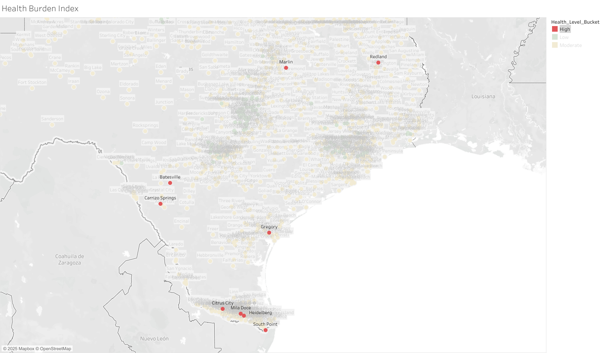

# Health Burden Index for Texas Cities (CDC PLACES Data, 2024 Release)
## Overview
This project analyzes city-level health burdens across Texas using the [**CDC PLACES Local 2024 dataset**](data) , which is based on 2022 BRFSS data. A custom **Health Burden Index (HBI)** was developed to assess the combined impact of four key health indicators: **obesity**, **diabetes**, **smoking**, and **depression**.

The goal is to identify cities with the highest health burden and explore patterns that can inform public health priorities and interventions.

## Objectives
* Calculate a Health Burden Index for each city in Texas
* Compare cities across Texas using HBI
* Provide insights and recommendations for public health planning
* Highlight high-burden areas with clear, map-based visualizations

## Dataset Structure
The final dataset was derived from two tables within the same dataset file from the **CDC PLACES Local 2024 dataset**. One table contained health indicators (e.g. **obesity**, **diabetes**, **smoking**, and **depression**) and their values, while the other provided population counts. Both tables were linked using a common identifier, **LocationId**, to create a unified dataset for analysis. 

## Technical Process
The project followed these key steps:
1. **Data Extraction**  
   - Retrieved 2024 CDC PLACES Local data via BigQuery.
   - Selected relevant columns such as **MeasureId**, **Data_Value**, **LocationName**, **LocationId**, and **Geolocation**.
   - Focused on four prevalent health indicators: **obesity**, **diabetes**, **smoking**, and **depression**, all based on 2022 BRFSS data.  
2. **Data Cleaning & Preparation**  
   - Removed rows with missing values for selected indicators.
   - Used CTEs to pivot and reshape the data.
   - Calculated a Health Burden Index based on the average from the crude prevalence values of obesity, diabetes, smoking, and depression.
   - Joined in total population estimates via VLOOKUP from a secondary table.
3. **Google Sheets Processing**  
   - Applied conditional formatting to flag high, moderate, and low burden cities.
   - Computed national averages via BigQuery and colored cities above/below benchmarks.
   - Filtered for only Texas cities with a population above 500.
4. **Visualization in Tableau**  
   - Created a choropleth-style map to visualize Health Burden Index across cities.
   - Emphasized cities labeled "High" based on threshold logic (>=30).
   - Labels and tooltip customization applied for clarity.

## Key Insights

## Recommendations

## Dashboard
A visualization was created in Tableau to highlight cities with high health burden scores. Link attached is to an interactive Texas map for high, moderate, and low Health Burden Index.
[Interactive Texas Health Burden Index](https://public.tableau.com/views/hbiplacestxover500/Sheet1?:language=en-US&:sid=&:redirect=auth&:display_count=n&:origin=viz_share_link)

## Repository Contents

## Disclaimer

---

- Filtered to Texas cities with population > 500
- Created a Health Burden Index = average of the 4 indicators

### 2. Data Formatting & Exploration (Google Sheets)
- Added population estimates using VLOOKUP
- Labeled cities by health burden level (High / Moderate / Low)
- Applied conditional formatting for quick visual scanning

### 3. Visualization (Tableau)
- Mapped all cities in Texas with geographic coordinates
- Applied color gradients by Health Burden Index
- Highlighted high-burden cities
- Annotated cities using labels and tooltips

https://data.cdc.gov/d/eav7-hnsx

---

## 📊 Key Insights

- Cities with the highest HBI are often smaller or mid-sized with limited population.
- Depression and obesity were consistent contributors in most high-burden cities.
- Urban centers generally had lower burden, but not always — highlighting disparities.

---

## ✅ Recommendations

- Prioritize health education and intervention efforts in identified **high-burden cities**.
- Support mental health infrastructure in regions with elevated depression rates.
- Encourage community-level data use to support targeted policy and funding.

