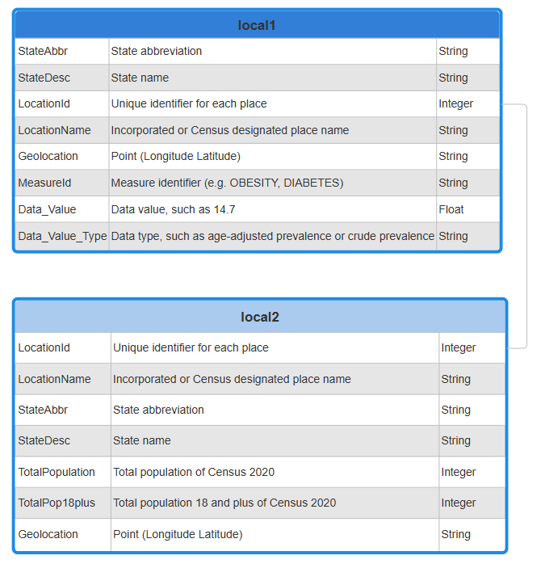
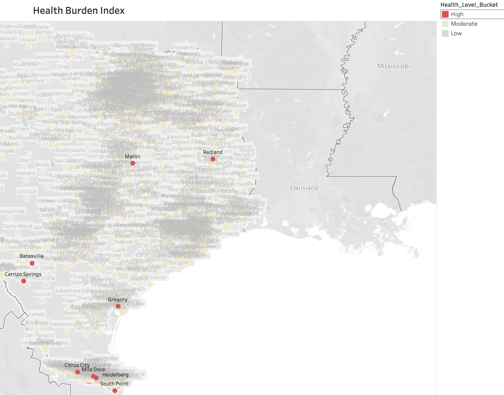
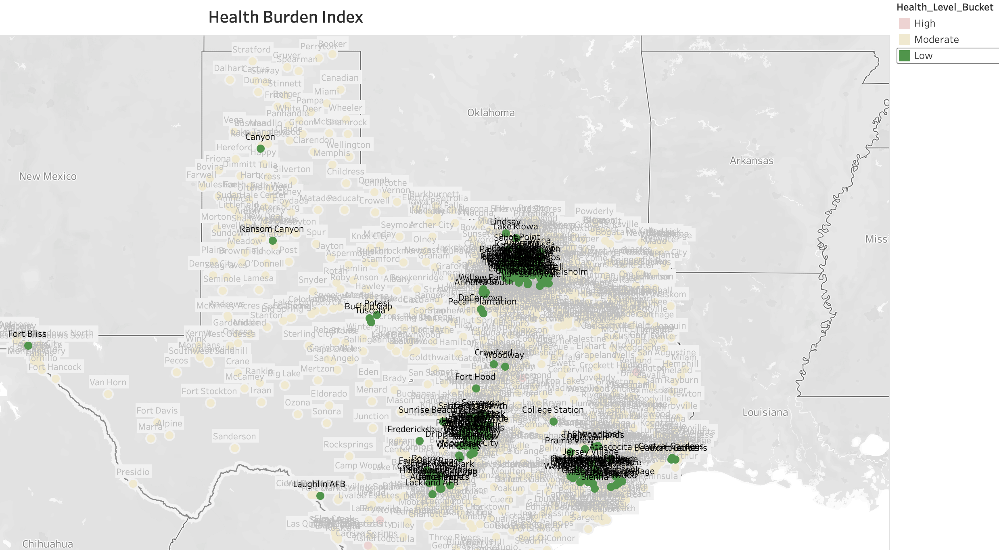

# Health Burden Index for Texas Cities (2024 CDC PLACES Data)
## Overview
This project analyzes chronic health burdens across Texas cities using the [**CDC PLACES Local 2024 dataset**](data/dataset_link.md), which is based on the 2022 Behavioral Risk Factor Surveillance System (BRFSS) data. A custom **Health Burden Index (HBI)** was developed to represent the average prevalence of four key conditions: **obesity**, **diabetes**, **smoking**, and **depression**.

**Units.** In PLACES, each condition’s value is the **percent of residents age 18 or older** in a city with that condition. The **HBI** is the **average of those four percentages**, so it’s expressed in **percentage points**. For example, an HBI of 30 means the four condition rates average **30 percentage points**.

The **Health Burden Index (HBI)** condenses city-level health risks into a single, interpretable score, enabling meaningful comparisons and clear geographic visualizations. This analysis focuses on identifying cities with the highest cumulative burden to inform data-driven public health planning across Texas. 


## Objectives
* Calculate a Health Burden Index for each city in Texas
* Compare cities across Texas using **Health Burden Index (HBI)**
* Provide insights and recommendations for public health planning
* Highlight high-burden areas with map-based visualizations to support geographic comparisons

## Dataset Structure
The final dataset was constructed by extracting city-level prevalence estimates (percent of residents age 18+) from the **[CDC PLACES Local 2024 dataset](data/dataset_link.md)** file. Health indicators were filtered to include **obesity**, **diabetes**, **smoking**, and **depression**, while **population counts** were joined from a secondary table using the shared **LocationId** field. 



## Technical Process
The project followed these key steps:
1. **Data Extraction**  
   * Retrieved 2024 CDC PLACES Local data via BigQuery.
   * Selected relevant columns such as **MeasureId**, **Data_Value**, **LocationName**, **LocationId**, and **Geolocation**.
     * **Data_Value** represents the percent of residents age 18+ with the condition.
   * Focused on four prevalent health indicators: **obesity**, **diabetes**, **smoking**, and **depression**, all based on the 2022 BRFSS data.  
2. **Data Cleaning & Preparation**  
   * Removed rows with missing values for selected indicators.
   * Used CTEs to pivot and reshape the data.
   * Calculated a **Health Burden Index (HBI)** as the mean of crude prevalence rates (%, age 18+) for **obesity, diabetes, smoking, and depression**.
     * ```sql
       ROUND ((Obesity + Diabetes + Smoking + Depression) / 4, 2) AS Health_Burden_Index
       ```
   * Joined in total population estimates via VLOOKUP from a secondary table.
3. **Google Sheets Processing**  
   * Applied conditional formatting to flag high, moderate, and low burden cities.
   * Computed national averages via BigQuery and colored cities above/below benchmarks.
   * Filtered for only Texas cities with a population above 500.
4. **Visualization in Tableau**  
   * Created a choropleth-style map to visualize **HBI** across cities.
   * Emphasized cities labeled "High" based on threshold logic (≥ 30).
   * Tooltips include city name, **HBI**, and condition values to preserve analytic depth.

### Data QA checks (quick sanity)
* **No nulls** in the four indicators used for HBI.
* **HBI bounds** are reasonable given inputs: min ≈ **7.75**, max ≈ **37.9**.
* **All cities** (before TX filter):
    * Counts: High **587** (1.96%), Moderate **21,949** (73.35%), Low **7,387** (24.69%) → Total **29,923**
* **Texas after filters (TotalPopulation > 500)**:
    * Counts: High **9** (0.72%), Moderate **1,068** (85.51%), Low **172** (13.77%) → Total **1,249**

For detailed logic, see the [SQL queries](work/sql_queries.sql) and the final [processed spreadsheet](work/HBI_place.xlsx). A full breakdown of each step is included in the [data cleaning notes](work/data_cleaning_notes.md).

## How to Reproduce
1. **Get the source data**
Download the PLACES Local 2024 release (BRFSS 2022) using the [link](data/dataset_link.md). Save the file(s) where your SQL environment can read them.

2. **Run the SQL to build the city-level table**
Open and run the [queries](work/sql_queries.sql) in BigQuery.
  * The script filters to YEAR = 2022, Data_Value_Type = 'Crude Prevalence', and these measures: OBESITY, DIABETES, CSMOKING, DEPRESSION.
  * It pivots to a wide table with one row per city/place and four columns for the indicators.

3. **Compute the Health Burden Index (HBI)**
Add an HBI column as the mean of the four prevalence rates (all values are percents for age 18+):
  ```sql
  ROUND ((Obesity + Diabetes + Smoking + Depression) / 4, 2) AS Health_Burden_Index
  ```
4. **Export for Google Sheets / CSV**
Export the resulting table to Google Sheets or CSV. If using Sheets, you can open the project [workbook](work/HBI_place.xlsx) to mirror the formatting and formulas.

5. **Apply categories and filters in Sheets**
  * HBI Categories: High (HBI ≥ 30), Moderate (20–29.99), Low (HBI < 20).
  * Benchmarks: Use the national averages calculated in SQL to color cells above/below benchmarks.
  * Texas focus: Filter to Texas and TotalPopulation > 500 (as described in [data cleaning notes](work/data_cleaning_notes.md)).


6. **Build or view the dashboard**
Connect the Sheet/CSV to Tableau Public and recreate the map with the same color logic and tooltips; or open the published dashboard (linked in the README).


## Key Findings
The analysis reveals patterns among cities with the highest **HBI** scores, including elevated condition rates, geographic clustering in South Texas, and consistently low population counts. 

* Nine cities in Texas were classified as having a **High HBI** (≥ 30), signaling significant challenges in **obesity**, **diabetes**, **smoking**, and **depression**.
* All high-burden cities **exceeded** national rates for **obesity**, **diabetes**, and **smoking**. Only **six out of the nine** exceeded the national benchmark for **depression**:
   * **Obesity**: National Avg = 36.37%, City Range = 48.5%–53.3%
   * **Diabetes**: National Avg = 13.03%, City Range = 20.5%–28.1%
   * **Smoking**: National Avg = 16.61%, City Range = 20.7%–26.1%
   * **Depression**: National Avg = 23.19%, Three cities—South Point (23.10%), Gregory (23.10%), and Carrizo Springs (22.90%)—fell just **below** the threshold
* All nine high-burden cities had populations **under 6,500**, with **seven** located in **South Texas**, highlighting **regional and rural disparities** in chronic health burden.
* Geographic and socioeconomic disparities were evident, as cities with the **lowest HBI** were primarily located in metropolitan areas such as **Austin, Dallas-Fort Worth, San Antonio,** and **Houston.**

## Visualizations
The final [dashboard](https://public.tableau.com/views/hbiplacestxover500/Sheet1?:language=en-US&:sid=&:redirect=auth&:display_count=n&:origin=viz_share_link) allows users to explore **HBI** patterns across **Texas** cities. Cities are color-coded by burden level and enriched with tooltips showing the city’s HBI and each condition’s rate (%) among residents age 18+. The static images below display **all** cities classified as having either **high** or **low HBI** scores, enabling quick side-by-side comparison.




## Recommendations
* **Target Local Interventions**: Focus public health resources on rural South Texas communities where chronic condition rates consistently exceed national averages.
* **Mobile Health Services**: Deploy mobile clinics or community health vans to improve access to screening, primary care, and mental health services in smaller towns with limited infrastructure.
* **School and Community-Based Programs**: Launch early-intervention programs targeting nutrition, physical activity, and mental health support in schools and community centers.

## Action Plan
* **Target Resources:** Direct outreach, education, and funding to **high-HBI** cities
* **Reassess Annually:** Update **HBI** scores yearly using new CDC PLACES releases
* **Track Outcomes:** Monitor progress in each city and refine strategies as needed

## Repository Contents
* README.md – Project overview, objectives, technical process, insights, and recommendations.
* data/ – Information about the dataset and external link to the full CDC PLACES dataset.
  * dataset_link.md – Link to the original CDC PLACES dataset (2024 release).
* work/ – Project work files, including SQL queries and spreadsheet.
  * sql_queries.sql – All SQL queries used for data filtering, cleaning, and analysis.
  * HBI_place.xlsx – Cleaned and processed spreadsheet with final calculations.
  * data_cleaning_notes.md – Step-by-step explanation of data cleaning and transformation steps.
* images/ – Static images and dataset schema visual references
  * places.png - Table schema and dataset structure diagram.
  * txhighbi.png - Tableau map visualization of high-burden Texas cities.
  * txlowhbi.png - Tableau map visualization of low-burden Texas cities.

## Disclaimer
This project is for educational and portfolio purposes only. The dataset used in this analysis is publicly available through the [**CDC PLACES: Local Data for Better Health 2024**](data/dataset_link.md). All data belongs to the original source.


